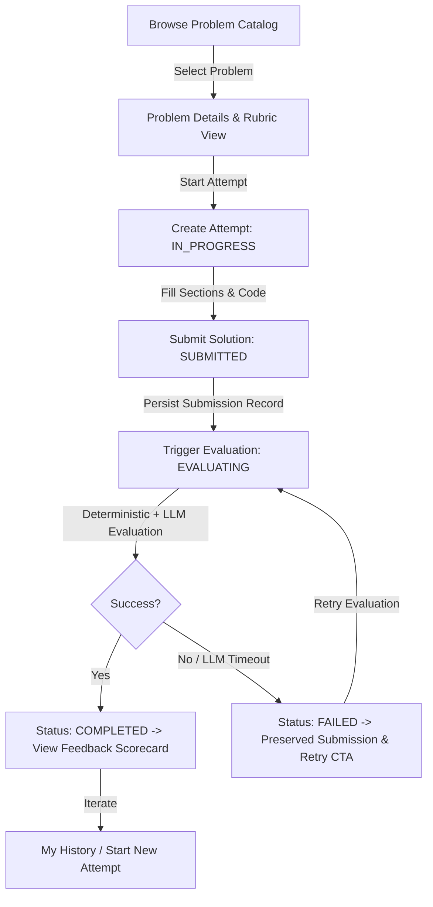
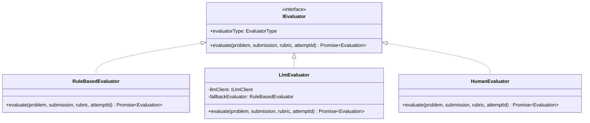

# System Design & Architecture Document: CipherLLD

---

## 1. MVP Scope & Learner Journey

### MVP Scope
The CipherLLD MVP delivers a complete, end-to-end Low-Level Design practice platform supporting 4 canonical interview problems (Parking Lot, Vending Machine, Elevator, Library Management). It encompasses:
- Problem catalog browsing and requirement exploration.
- A split-panel practice workspace with integrated Monaco Code Editor.
- Enforced four-part submission structure (Assumptions, Class Design, Explanation, Code).
- Robust state-machine orchestration preserving submissions before evaluation.
- Deterministic structural checks and schema-constrained LLM rubric evaluation.
- Detailed feedback scorecard with visual score gauges and retry capabilities.
- Chronological attempt history log.

### Learner Journey


---

## 2. Domain Model & Class Responsibilities

```
+-------------------------------------------------------------------------+
|                                DOMAIN                                   |
+-------------------------------------------------------------------------+
|  Entities:                                                              |
|  - Problem: id, slug, title, description, requirements, rubric          |
|  - Rubric: id, problemId, criteria: EvaluationCriterion[], totalScore   |
|  - EvaluationCriterion: key, name, description, maxScore, weight       |
|  - Attempt: id, userId, problem, status, submission, evaluation         |
|  - Submission: id, attemptId, assumptions, classDesign, explanation,   |
|                code, submittedAt                                        |
|  - Evaluation: id, attemptId, overallScore, summary, evaluatorType,     |
|                criteriaResults: CriterionResult[], completedAt          |
|                                                                         |
|  Value Objects:                                                         |
|  - CriterionResult: criterionKey, criterionName, score, maxScore,       |
|                     evidence, concern, suggestion, confidence           |
|                                                                         |
|  Contracts:                                                             |
|  - IEvaluator: evaluate(problem, submission, rubric, attemptId)        |
|  - IAttemptRepository, ISubmissionRepository, IEvaluationRepository   |
+-------------------------------------------------------------------------+
```

### Core Domain Entities
1. **`Attempt`**: The aggregate root governing the candidate practice session lifecycle. Enforces valid state transitions and guards against invalid operations (e.g. submitting an already completed attempt).
2. **`Submission`**: Immutable entity representing the candidate's four-part solution snapshot. Provides validation logic (`validateCompleteness()`).
3. **`Evaluation`**: Immutable entity capturing the quantitative score and qualitative feedback mapped across rubric dimensions.
4. **`Problem` & `Rubric`**: Encapsulates problem statements, functional requirements, constraints, and the multidimensional criteria weighting.

---

## 3. Interfaces & Dependency Inversion

All dependencies flow inwards towards the core domain model:

```
[ Express Controllers ] ──> [ Application Services ] ──> [ Domain Entities & Contracts ]
[ Database Repositories ] ──────────────────────────────────────────┘
[ LLM Evaluator Adapters ] ─────────────────────────────────────────┘
```

### Core Interface Contracts
- **`IEvaluator`**: Strategy interface for all evaluation engines (`evaluate(problem, submission, rubric, attemptId): Promise<Evaluation>`).
- **`IAttemptRepository`**: Repository contract for querying and persisting `Attempt` aggregates.
- **`ISubmissionRepository`**: Repository contract for persisting and retrieving candidate `Submission` records.
- **`IEvaluationRepository`**: Repository contract for persisting evaluation scorecards.
- **`ILlmClient`**: Isolated communication contract for external LLM inference (`generateCompletion(prompt): Promise<string>`).

---

## 4. Evaluator Architecture (Strategy Pattern)



### Deterministic vs. LLM Evaluation
- **`RuleBasedEvaluator`**: Performs deterministic checks:
  - Required sections exist and satisfy minimum length thresholds.
  - Presence of structural syntax patterns (`class`, `interface`, `abstract`).
  - *Explicit limitation*: It does not evaluate semantic architectural elegance or SOLID design patterns.
- **`LlmEvaluator`**:
  - Injects problem requirements, candidate solution, and fixed rubric criteria into a structured prompt.
  - Enforces strict JSON schema validation via Zod before creating domain `Evaluation` entities.
  - Evaluates 5 standardized dimensions: *Requirement Alignment*, *SOLID & Abstraction*, *Design Patterns*, *Edge Cases & Concurrency*, and *Coupling & Cohesion*.
  - Prevents ungrounded 100-point scores by requiring fractional scores and evidence-backed rationale per criterion.

---

## 5. Submission Architecture & State Machine

```
              ┌─────────────┐
              │ IN_PROGRESS │
              └──────┬──────┘
                     │ (submit solution)
                     ▼
               ┌───────────┐
               │ SUBMITTED │ ◄──────────────────────┐
               └─────┬─────┘                        │
                     │ (begin evaluation)           │ (retry evaluation)
                     ▼                              │
              ┌─────────────┐                       │
              │ EVALUATING  │                       │
              └──────┬──────┘                       │
                     │                              │
         ┌───────────┴───────────┐                  │
 (eval success)             (eval failure)          │
         ▼                       ▼                  │
   ┌───────────┐            ┌───────────┐           │
   │ COMPLETED │            │  FAILED   ├───────────┘
   └───────────┘            └───────────┘
```

### Critical State Machine Invariants
1. **Submission Persistence Isolation**: The submission is written and committed to the database while transitioning `IN_PROGRESS` $\rightarrow$ `SUBMITTED`. Evaluation *only* starts after the submission is safe.
2. **Crash Resilience**: If the LLM provider fails, times out, or returns invalid JSON, the status transitions to `FAILED` with an explanatory error message. The submission is **never** deleted.
3. **Idempotent Evaluation**: Calling evaluation on an already `COMPLETED` attempt returns the existing evaluation without re-triggering LLM calls.
4. **Guarded Transitions**: Attempting to evaluate an `IN_PROGRESS` attempt without submission throws an explicit domain violation.

---

## 6. API Architecture & Data Transfer Objects

| Method | Endpoint | Purpose | Request Body | Response DTO |
|---|---|---|---|---|
| `GET` | `/api/problems` | List problem catalog | None | `ProblemSummaryDTO[]` |
| `GET` | `/api/problems/:id` | Fetch single problem & rubric | None | `ProblemDetailsDTO` |
| `POST` | `/api/attempts` | Start practice session | `{ userId, problemId }` | `AttemptDTO` (`IN_PROGRESS`) |
| `GET` | `/api/attempts/:id` | Fetch attempt by ID | None | `AttemptDTO` |
| `GET` | `/api/attempts/user/:userId` | Get user attempt history | None | `AttemptDTO[]` |
| `POST` | `/api/attempts/:id/submit` | Submit solution components | `{ assumptions, classDesign, explanation, code }` | `{ attempt: AttemptDTO, submission: SubmissionDTO }` |
| `GET` | `/api/attempts/:id/evaluation` | Fetch evaluation scorecard | None | `EvaluationDTO` |
| `POST` | `/api/attempts/:id/evaluation/retry` | Retry evaluation | None | `EvaluationDTO` |

---

## 7. Database Design & Schemas

### MongoDB Collections
1. **`problems`**:
   - `_id`: String (e.g. `prob-parking-lot`)
   - `slug`, `title`, `description`, `requirements`: String[]
   - `assumptions`: String[], `difficulty`: Enum (`EASY`, `MEDIUM`, `HARD`)
   - `rubric`: Embedded sub-document with criteria weights
2. **`attempts`**:
   - `_id`: String (UUID / timestamp-slug)
   - `userId`: String (indexed)
   - `problemId`: String (indexed)
   - `status`: Enum (`IN_PROGRESS`, `SUBMITTED`, `EVALUATING`, `COMPLETED`, `FAILED`)
   - `startedAt`, `completedAt`: Date
3. **`submissions`**:
   - `_id`: String, `attemptId`: String (unique index)
   - `assumptions`, `classDesign`, `explanation`, `code`: String
   - `submittedAt`: Date
4. **`evaluations`**:
   - `_id`: String, `attemptId`: String (unique index)
   - `overallScore`: Number, `summary`: String, `evaluatorType`: Enum
   - `criteriaResults`: Array of `{ criterionKey, score, maxScore, evidence, concern, suggestion, confidence }`
   - `completedAt`: Date

---

## 8. Important Architectural Trade-offs

1. **Synchronous vs. Asynchronous Evaluation**:
   - *Trade-off*: Synchronous HTTP evaluation simplifies the practice flow without requiring Redis / BullMQ workers, but holds the client connection for 3–5 seconds during LLM inference.
   - *Mitigation*: Client UI displays dedicated `evaluating` spinner with clear status messages, and backend supports safe retry if the connection drops.
2. **Structured Four-Part Form vs. Single Unstructured Editor**:
   - *Trade-off*: Separate inputs force candidates to follow a structured methodology rather than dumping raw code, ensuring rubric dimensions can be mapped directly to specific parts of the submission.
3. **In-Memory MongoDB for Testing vs. Mocked Database Layer**:
   - *Trade-off*: Using `mongodb-memory-server` in integration tests adds ~1s of initial startup time, but provides 100% realistic verification of Mongoose indexes, unique constraints, and upsert operations.

---

## 9. Extensibility Verifications

### Change Test A: Adding Class Diagram Submissions
- **Modification**: Add `diagram?: string` to `Submission` entity and Mongoose schema.
- **Core Impact**: `AttemptService`, `EvaluationService`, `AttemptController`, and the core state machine require **0 changes**.

### Change Test B: Adding HumanEvaluator
- **Modification**: Create a new class `HumanEvaluator implements IEvaluator`.
- **Core Impact**: `EvaluationService` consumes `IEvaluator` via DI and requires **0 changes**.
